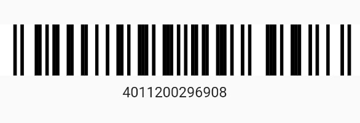

# flutter_barcode

A custom widget which generates and displays a barcode.

## Spec

- JAN
- NW7

## install

```yaml:pubspec.yaml
dependencies:
  flutter_barcode:
    git: git@github.com:ItoYo16u/flutter_barcode.git

```

## Example

```dart

  Column(
    children:[
      BarcodePaint(
        Barcode.jan('4011200296908'), // or Barcode.nw7("<...>")
          size: Size(100,50),
        ),
        Container(
          align:Alignment.center,
          padding: EdgeInsets.all(8),
          child: Text('4011200296908')
      ]
  );
```


